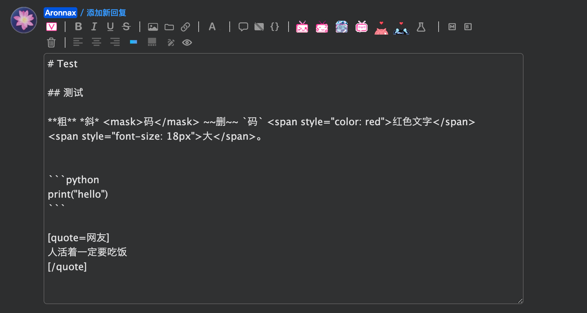
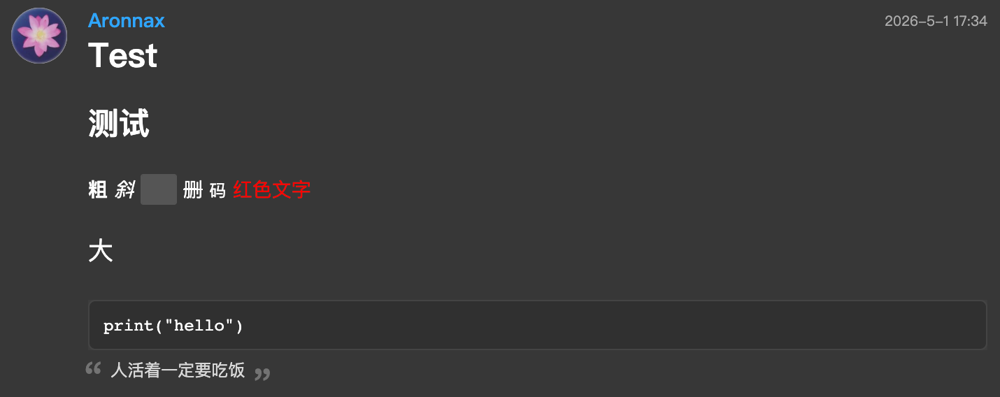
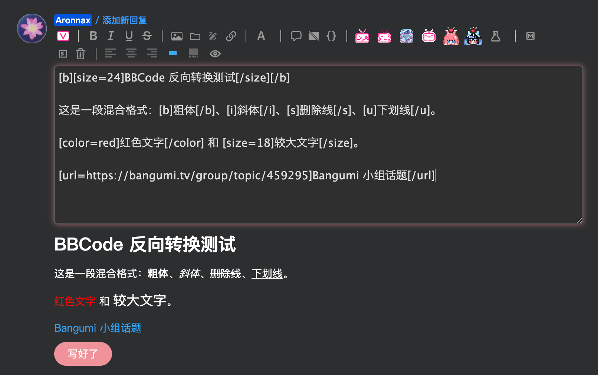
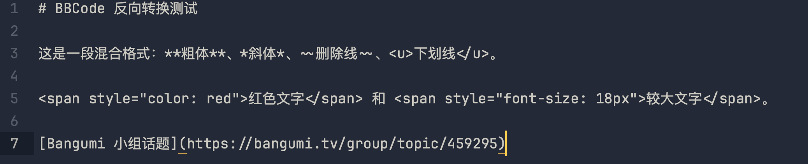
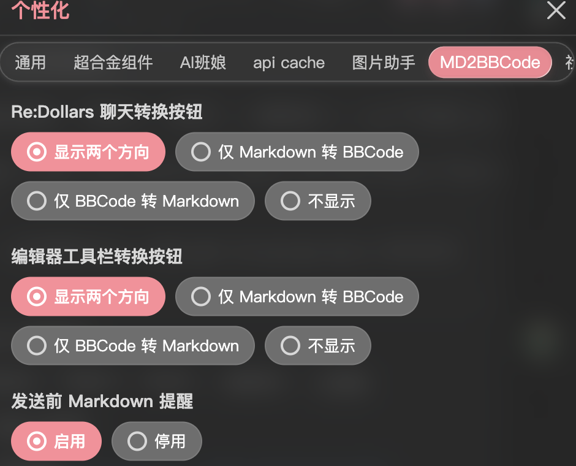

# Bangumi Markdown 与 BBCode 互转

在 Bangumi 发帖、回复、写日志时，可以先用 Markdown 把内容写顺，再一键转成站内可用的 BBCode。也可以把已有 BBCode 转回 Markdown，方便继续修改。

  
  
  
  

## 功能

- **Markdown 转 BBCode**：标题、粗体、斜体、删除线、链接、图片、引用、列表、代码、分割线等常用写法都可以转换。
- **BBCode 转 Markdown**：把旧帖、草稿或别人给你的 BBCode 转回更好编辑的 Markdown。
- **只转换选中内容**：选中一段文字时，只处理选区；不选中时处理整个输入框。
- **发送前提醒**：当写好 Markdown 内容而为转为 BBCode，会发送提示是否转换
- **Markdown 与 BBCode 混排**：混写 Markdown 和已有 `[img]`、`[quote]`、`[code]` 时，会尽量保留原本可用的 BBCode，反之亦可。
- **Re:Dollars 适配**：适配 [Re:Dollars](https://bangumi.tv/dev/app/4337) 常见 BBCode
- **超合金组件菜单**

## 演示

### Markdown 转 BBCode

转换前

转换后

### BBCode 转 Markdown

转换前

转换后

### 超合金组件选单

同时支持 BBCode 与 Markdown 混排，发送前监测等功能！

## 安装

推荐直接安装 Bangumi 站内组件：

- [Bangumi 超合金组件](https://bangumi.tv/dev/app/6020)

也可以通过 Tampermonkey 或兼容脚本管理器安装用户脚本版：

- [Greasy Fork 脚本页](https://greasyfork.org/zh-CN/scripts/575652-bangumi-markdown-%E8%BD%AC-bbcode)
- 备用：[GitHub Raw](https://github.com/aronnaxlin/md2bbcode/raw/refs/heads/main/dist/md2bbcode.greasyfork.user.js)
- 备用：[Gitee Raw](https://raw.giteeusercontent.com/aronnaxlin/md2bbcode/raw/main/dist/md2bbcode.greasyfork.user.js)

安装后刷新 Bangumi 页面。进入支持 BBCode 的编辑框，点击输入框后，工具栏里会出现转换按钮。

## 项目地址

- [Bangumi 超合金组件](https://bangumi.tv/dev/app/6020)
- [GitHub 源码仓库](https://github.com/aronnaxlin/md2bbcode)
- [Gitee 源码仓库](https://gitee.com/aronnaxlin/md2bbcode)
- [Greasy Fork 信息页](https://greasyfork.org/zh-CN/scripts/575652-bangumi-markdown-%E8%BD%AC-bbcode)

## 文档

- [`支持的格式`](./docs/compatible_formats.md)
- [`开发指南`](./docs/develop_guide.md)

## 致谢

感谢 [furtherun/bangumi-blog-markdown-desktop](https://github.com/furtherun/bangumi-blog-markdown-desktop/) 的早期探索。这个项目验证了 Markdown 转 Bangumi BBCode 的可行性，也提供了不少贴近 Bangumi 日志排版的经验规则。
